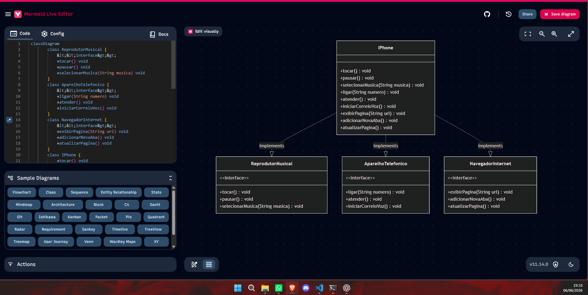
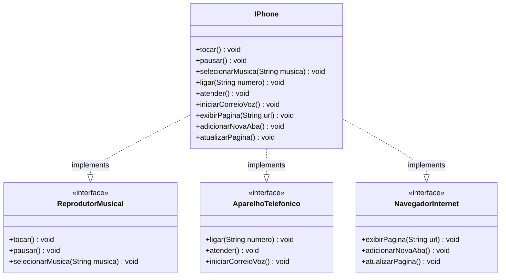

# Desafio POO — iPhone

## Diagrama UML





## Estrutura do Projeto

```
desafioIPhone/
└── src/
    └── desafio/
        ├── ReprodutorMusical.java   (interface)
        ├── AparelhoTelefonico.java  (interface)
        ├── NavegadorInternet.java   (interface)
        ├── IPhone.java              (classe que implementa as 3 interfaces)
        └── Main.java                (classe de teste)
```

## Funcionalidades

### Reprodutor Musical
| Método | Descrição |
|--------|-----------|
| `tocar()` | Inicia a reprodução da música |
| `pausar()` | Pausa a reprodução |
| `selecionarMusica(String)` | Seleciona uma música pelo nome |

### Aparelho Telefônico
| Método | Descrição |
|--------|-----------|
| `ligar(String)` | Realiza ligação para um número |
| `atender()` | Atende uma chamada |
| `iniciarCorreioVoz()` | Acessa o correio de voz |

### Navegador Internet
| Método | Descrição |
|--------|-----------|
| `exibirPagina(String)` | Exibe uma página pela URL |
| `adicionarNovaAba()` | Abre uma nova aba |
| `atualizarPagina()` | Atualiza a página atual |

## Como Executar

```bash
cd desafioIPhone
javac -d bin src/desafio/*.java
java -cp bin desafio.Main
```

## Saída Esperada

```
=== Reprodutor Musical ===
Música selecionada: Bohemian Rhapsody - Queen
Tocando música...
Música pausada.

=== Aparelho Telefônico ===
Ligando para (11) 99999-1234...
Chamada atendida.
Iniciando correio de voz...

=== Navegador Internet ===
Exibindo página: https://www.google.com
Nova aba adicionada.
Página atualizada.
```
